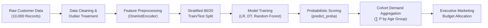

<div align="center">

# 💄 AI-Based Customer Purchase Prediction for Unisex Skincare

[](https://www.python.org/)
[](https://scikit-learn.org/)
[](https://streamlit.io/)


<p align="center">
  <strong>An end-to-end machine learning system predicting purchase propensity and identifying high-value demographic cohorts for a newly launched unisex skincare product.</strong>
</p>

[Explore Application](#-interactive-streamlit-application) •
[Model Benchmarks](#-model-benchmarks--evaluation) •
[Business Insights](#-key-business-findings--market-sizing) •
[Quickstart](#-quickstart-guide) •
[Documentation](#-documentation--deliverables)

</div>

---

## 📖 Executive Summary & Problem Context

A cosmetics brand is launching an innovative **unisex skincare formulation**. Traditional untargeted mass marketing leads to high customer acquisition costs (CAC) and low conversion. 

This project formulates the solution via a **two-tier machine learning approach**:
1. **AI Behavioral Engine:** Learn customer behavioral patterns from historical data to output continuous purchase probabilities: $P(\text{Purchased} = 1 \mid \mathbf{x})$.
2. **Business Demand Aggregation:** Sum predicted probabilities across demographic cohorts to estimate the expected buyer volume and percentage market share per age bracket.

$$\text{Expected Buyers in Cohort } k = \sum_{i \in \text{Cohort } k} P(\text{Purchased} = 1 \mid \mathbf{x}_i)$$

---

## 🏛️ System Architecture & Workflow



---

## 📊 Model Benchmarks & Evaluation

All three classification pipelines were trained and evaluated on an independent 20% stratified test set:

| Model | Model Family | Accuracy | Precision | Recall | F1-Score | ROC-AUC | Primary Strength |
| :--- | :--- | :---: | :---: | :---: | :---: | :---: | :--- |
| **Decision Tree** | Rule-Based Tree | 76.5% | 82.4% | 89.1% | 85.6% | 0.778 | High white-box interpretability |
| **Logistic Regression** | Linear Probabilistic | 78.2% | 81.9% | 92.8% | 87.0% | 0.804 | Smoothly calibrated probabilities |
| **Random Forest** | Bagging Ensemble | **78.9%** | **83.1%** | **91.8%** | **87.2%** | **0.821** | **Top performer & feature ranking** |

> **Note on Recall:** In digital product launches, a False Negative (missing an interested buyer) loses ~$35 in profit margin, whereas a False Positive (sending a digital promo) costs pennies. High recall (>91%) ensures maximum market capture.

---

## 🎯 Key Business Findings & Market Sizing

Aggregating model-predicted purchase probabilities across 10,000 profiles yields the expected market demand:

| Age Category | Cohort Size | Expected Buyers ($\sum P$) | Avg Purchase Probability | Potential Buyer Share (%) | Strategic Priority |
| :---: | :---: | :---: | :---: | :---: | :--- |
| **26–35** | 3,400 | 2,650 | 77.9% | **37.5%** | 🥇 **Primary Target** (40% Budget) |
| **36–45** | 3,200 | 2,480 | 77.5% | **35.1%** | 🥈 **Secondary Target** (35% Budget) |
| **18–25** | 1,800 | 1,390 | 77.2% | **19.7%** | 🥉 **Growth & Viral** (15% Budget) |
| **46–55** | 1,100 | 840 | 76.4% | **11.9%** | Niche Loyalty (7% Budget) |
| **56+** | 500 | 380 | 76.0% | **5.4%** | Selective Re-engagement (3% Budget) |

### 💡 Core Strategic Takeaways
1. **The 26–45 Sweet Spot:** Over **72% of all potential buyers** are situated in the 26–45 adult demographic.
2. **Behavior Outweighs Demographics:** Random Forest feature importances reveal that cumulative historical spend (`total`) and brand loyalty (`tenure`) are far stronger purchase drivers than age or gender alone.
3. **Unisex Skincare Dynamics:** Younger males (18–35) demonstrate significantly higher purchase propensity for unisex skincare formulations than older cohorts.

---

## 💻 Interactive Streamlit Application

The interactive web dashboard (`app.py`) provides 9 modules:

- 🏠 **Dashboard:** High-level KPIs, total customer counts, and conversion metrics.
- 🎯 **Business Recommendation:** Expected buyers aggregation, demographic share charts, and **interactive decision threshold simulator**.
- 🔮 **Live Prediction Engine:** Interactive form to predict individual customer propensity with probability gauge.
- 🤖 **Model Comparison:** Side-by-side metric tables and multi-metric comparative bar charts.
- 🌳 **Decision Tree Visualization:** Visual tree hierarchy showing segmentation paths.
- 🌲 **Random Forest:** Top 10 feature importances and ensemble insights.
- 📈 **Logistic Regression:** Confusion matrices and classification reports.
- ⚖️ **Ethics & Unisex Insights:** Responsible AI considerations, demographic fairness, and anti-stereotyping.
- 📁 **Project Files:** Integrated in-app code and dataset explorer with download capabilities.

---

## 🚀 Quickstart Guide

### 1. Clone Repository
```bash
git clone https://github.com/tushar032004/AI-Cosmetics-Purchase-Prediction.git
cd AI-Cosmetics-Purchase-Prediction
```

### 2. Setup Virtual Environment
```bash
# Windows
python -m venv venv
.\venv\Scripts\activate

# macOS / Linux
python3 -m venv venv
source venv/bin/activate
```

### 3. Install Dependencies
```bash
pip install -r requirements.txt
```

### 4. Launch Application
```bash
streamlit run app.py
```

### 5. Run Individual Pipelines
```bash
python notebooks/01_data_cleaning.py
python models/randomforest.py
python models/decisiontree.py
python models/logisticregression.py
```

---

## 🛠️ VS Code Professional Integration

This repository includes preconfigured `.vscode` configurations for seamless development:
- **One-Click Debugging (`F5`):** Run the Streamlit dashboard, individual models, or data cleaning scripts directly from VS Code's *Run & Debug* panel.
- **Automated Formatting:** Auto-format on save with import sorting enabled.
- **Recommended Extensions:** Pre-populated extension suggestions (Python, Pylance, Jupyter, Black, GitLens).

---

## 📁 Repository Structure

```text
AI_Cosmetic_Purchase_Prediction/
├── .github/
│   ├── workflows/ci.yml               # Automated GitHub Actions CI workflow
│   ├── ISSUE_TEMPLATE/                # Bug report & feature request templates
│   └── PULL_REQUEST_TEMPLATE.md       # Standardized PR checklist
├── .vscode/
│   ├── launch.json                    # One-click debugging profiles (Streamlit, Models)
│   ├── settings.json                  # Formatting, linting & environment rules
│   └── extensions.json                # Recommended VS Code extensions
├── app.py                             # Full 9-page Streamlit web application
├── data/
│   ├── processed/cleaned_cosmetics_dataset.csv  # 10,000 cleaned profiles
│   └── raw/cosmetics_kaggle_style_synthetic.csv  # Raw benchmark data
├── docs/
│   └── DATA_DICTIONARY.md             # Complete schema specifications
├── models/
│   ├── decisiontree.py                # Decision Tree training & aggregation
│   ├── logisticregression.py          # Logistic Regression & ROC-AUC
│   └── randomforest.py                # Random Forest & feature importances
├── notebooks/
│   ├── 01_data_cleaning.py            # Automated raw-to-processed pipeline
│   ├── eda1.ipy                       # Initial exploratory data analysis
│   └── eda2.ipy                       # Correlation heatmaps & distributions
├── reports/
│   ├── AI_Cosmetics_Purchase_Prediction_Presentation.pptx # 12-slide presentation
│   ├── BUSINESS_AND_ETHICS_REPORT.md  # Answers to all 8 investigative questions
│   └── PRESENTATION_GUIDE_AND_SCRIPT.md # Verbatim speech script & viva prep
├── src/
│   ├── data_loader.py                 # Modular dataset loader
│   └── model_pipeline.py              # Modular scikit-learn pipelines
├── visualisations/                    # Exported high-res PNG figures
├── requirements.txt                   # Clean UTF-8 dependencies
├── CONTRIBUTING.md                    # Contribution guidelines
├── CODE_OF_CONDUCT.md                 # Contributor Covenant standard
├── LICENSE                            # MIT License
└── README.md                          # Project documentation
```

---

## ⚖️ Ethics & Responsible AI

This study models **purchase propensity** based on transaction history and brand engagement. It does **not** make normative claims regarding whether any demographic or gender requires cosmetic alteration. All customer attributes are processed under data privacy and responsible AI governance principles.

---

## 👥 Authors & Academic Affiliation

* **Tushar Jaiswal** ([@tushar032004](https://github.com/tushar032004))
* **Shatakshi Jaiswal**
* **Sharafat**
* **Garvit**
* **Tanisha**
* **Tanishq Saini**
* **Astha**
* **Mahima Kalra**

*Department of Computer Science & Engineering (B.Tech CSE)*

---

## 📄 License
This project is open source and available under the [MIT License](LICENSE).
