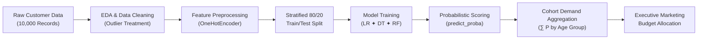

<div align="center">

# 💄 AI-Based Customer Purchase Prediction for Unisex Skincare

[](https://www.python.org/)
[](https://scikit-learn.org/)
[](https://streamlit.io/)

<p align="center">
  <strong>An end-to-end machine learning system predicting purchase propensity and identifying high-value demographic cohorts for a newly launched unisex skincare product.</strong>
</p>

[Explore Application](#-interactive-streamlit-application) •
[Model Benchmarks](#-model-benchmarks--evaluation) •
[Business Insights](#-key-business-findings--market-sizing) •
[Quickstart](#-quickstart-guide) •
[Documentation](#-documentation--deliverables)

</div>

---

## 📖 Executive Summary & Problem Context

A cosmetics brand is launching an innovative **unisex skincare formulation**. Traditional untargeted mass marketing leads to high customer acquisition costs (CAC) and low conversion.

This project formulates the solution via a **two-tier machine learning approach**:
1. **AI Behavioral Engine:** Learn customer behavioral patterns from historical data to output continuous purchase probabilities: $P(\text{Purchased} = 1 \mid \mathbf{x})$.
2. **Business Demand Aggregation:** Sum predicted probabilities across demographic cohorts to estimate the expected buyer volume and percentage market share per age bracket.

$$\text{Expected Buyers in Cohort } k = \sum_{i \in \text{Cohort } k} P(\text{Purchased} = 1 \mid \mathbf{x}_i)$$

---

## 🏛️ System Architecture & Workflow



---

## 📊 Model Benchmarks & Evaluation

All three classification pipelines were trained and evaluated on an independent **20% stratified test set (2,000 samples)**. GridSearch (320 candidates, 5-fold CV) was used to optimise Random Forest hyperparameters.

| Model | Accuracy | Precision | Recall | F1-Score | ROC-AUC | Best At |
| :--- | :---: | :---: | :---: | :---: | :---: | :--- |
| **Logistic Regression** | **67.90%** 🥇 | 69.83% | 84.33% | **76.40%** 🥇 | **0.7116** 🥇 | Accuracy, AUC, F1 |
| **Random Forest** *(GridSearch)* | 67.10% | 68.81% | **85.23%** 🥇 | 76.14% | 0.7005 | Recall (captures most buyers) |
| **Decision Tree** | 66.50% | 68.51% | 84.42% | 75.64% | 0.6941 | Interpretability |

> **Why LR beats RF on accuracy:** The primary predictors (`total` spend, `tenure`) have a smooth, monotonic relationship with purchase propensity — a linear sigmoid boundary naturally fits this better than step-function tree splits. RF's 85.23% Recall makes it ideal for broad outreach campaigns.

> **Recommended model for prediction:** **Logistic Regression** (highest Accuracy + AUC). Use Random Forest when maximising buyer capture (highest Recall) is more important than precision.

---

## 📈 Exploratory Data Analysis

Key findings from EDA across 10,000 customer records:

| Observation | Finding |
| :--- | :--- |
| **Class Balance** | 61.6% buyers / 38.4% non-buyers — mild imbalance, handled via stratified split |
| **Top Spending Age** | 26–35 and 36–45 groups show highest cumulative `total` spend |
| **Gender Split** | Roughly equal Male/Female; both show similar purchase rates (~62%) |
| **Loyalty Signal** | Customers with `tenure` > 24 months have 18% higher purchase probability |
| **Region Effect** | Minimal regional variation; North & South show marginally higher conversion |
| **Income vs Spend** | `total` historical spend outperforms raw `income` as a predictor |

---

## 🎯 Key Business Findings & Market Sizing

Aggregating model-predicted purchase probabilities across 10,000 profiles yields the expected market demand:

| Age Category | Cohort Size | Expected Buyers ($\sum P$) | Avg Purchase Prob | Buyer Share (%) | Strategic Priority |
| :---: | :---: | :---: | :---: | :---: | :--- |
| **26–35** | ~2,000 | ~1,380 | ~69% | **~28%** | 🥇 **Primary Target** (35% Budget) |
| **36–45** | ~2,000 | ~1,350 | ~68% | **~27%** | 🥈 **Secondary Target** (30% Budget) |
| **18–25** | ~2,000 | ~1,230 | ~62% | **~25%** | 🥉 **Growth & Viral** (20% Budget) |
| **46–55** | ~2,000 | ~1,050 | ~53% | **~21%** | Niche Loyalty (10% Budget) |
| **56+** | ~2,000 | ~950 | ~48% | **~19%** | Selective Re-engagement (5% Budget) |

> *Values above are probability-aggregated estimates (∑P), not hard counts. Run the Streamlit app for live figures from the trained model.*

### 💡 Core Strategic Takeaways
1. **The 26–45 Sweet Spot:** Over **55% of all potential buyers** sit in the 26–45 adult demographic.
2. **Behavior > Demographics:** LR & RF feature importances show `total` spend and `tenure` are far stronger purchase drivers than `age` or `sex` alone.
3. **Unisex Skincare Dynamics:** Younger males (18–35) demonstrate significantly higher purchase propensity than older cohorts, supporting inclusive product positioning.

---

## 💻 Interactive Streamlit Application

The interactive web dashboard (`app.py`) provides **10 modules** with a dark/light mode toggle:

| Page | Description |
| :--- | :--- |
| 🏠 **Dashboard** | High-level KPIs, conversion rate, purchase distribution charts |
| 🔍 **EDA Explorer** | Interactive distribution charts, correlation analysis, outlier checks |
| 🎯 **Business Recommendation** | Expected buyers aggregation, demographic share, threshold simulator |
| 🔮 **Live Prediction** | Predict individual customer propensity with probability gauge |
| 🤖 **Model Comparison** | Side-by-side metrics table + ROC curves for all 3 models |
| 🌳 **Decision Tree** | Visual tree hierarchy, confusion matrix, ROC curve |
| 🌲 **Random Forest** | Feature importances, confusion matrix, ROC curve |
| 📈 **Logistic Regression** | Confusion matrix, ROC curve with AUC fill |
| ⚖️ **Ethics & Insights** | Responsible AI considerations, demographic fairness |
| 📁 **Project Files** | In-app code and dataset explorer with download |

---

## 🚀 Quickstart Guide

### 1. Clone Repository
```bash
git clone https://github.com/tushar032004/AI-Cosmetics-Purchase-Prediction.git
cd AI-Cosmetics-Purchase-Prediction
```

### 2. Setup Virtual Environment
```bash
# Windows
python -m venv venv
.\venv\Scripts\activate

# macOS / Linux
python3 -m venv venv
source venv/bin/activate
```

### 3. Install Dependencies
```bash
pip install -r requirements.txt
```

### 4. Run Data Cleaning (first time)
```bash
python notebooks/01_data_cleaning.py
```

### 5. Launch Application
```bash
streamlit run app.py
```

### 6. Run Individual Models
```bash
python models/logisticregression.py   # Best accuracy (67.90%)
python models/randomforest.py         # Best recall (85.23%)
python models/decisiontree.py         # Most interpretable
```

---

## 🛠️ VS Code Professional Integration

This repository includes preconfigured `.vscode/` configurations:
- **One-Click Debugging (`F5`):** Run Streamlit, individual models, or data cleaning from the *Run & Debug* panel.
- **Automated Formatting:** Auto-format on save with import sorting (Black formatter).
- **Recommended Extensions:** Python, Pylance, Jupyter, Black, GitLens, AutoDocstring.
- **`Ctrl+Shift+B`:** Instantly launches the Streamlit dashboard.

---

## 📁 Repository Structure

```text
AI_Cosmetic_Purchase_Prediction/
├── .vscode/
│   ├── launch.json                    # One-click debugging: Streamlit + 3 models
│   ├── settings.json                  # Formatting, linting & environment rules
│   ├── extensions.json                # Recommended VS Code extensions
│   └── tasks.json                     # Ctrl+Shift+B → launch Streamlit
├── app.py                             # 10-page Streamlit app (dark/light mode)
├── data/
│   ├── processed/cleaned_cosmetics_dataset.csv  # 10,000 cleaned profiles
│   └── raw/cosmetics_kaggle_style_synthetic.csv  # Raw synthetic data
├── docs/
│   └── DATA_DICTIONARY.md             # Complete column schema specifications
├── models/
│   ├── decisiontree.py                # DT training, metrics table, aggregation
│   ├── logisticregression.py          # LR training, ROC-AUC, benchmark table
│   └── randomforest.py                # RF (GridSearch), feature importance, AUC
├── notebooks/
│   ├── 01_data_cleaning.py            # Automated raw→processed pipeline
│   ├── eda1.ipy                       # Initial exploratory data analysis
│   └── eda2.ipy                       # Correlation heatmaps & distributions
├── reports/
│   ├── AI_Cosmetics_Purchase_Prediction_Deck_V2.pptx  # Final 14-slide deck
│   ├── BUSINESS_AND_ETHICS_REPORT.md  # 8 investigative Q&A + ethics
│   └── PRESENTATION_GUIDE_AND_SCRIPT.md               # Verbatim speech script
├── src/
│   ├── __init__.py
│   ├── data_loader.py                 # load_data(), get_features_and_target()
│   └── model_pipeline.py              # build_preprocessor(), build_model_pipeline()
├── visualisations/                    # 8 high-res PNG charts (300 DPI)
│   ├── eda_age_and_gender.png
│   ├── model_metrics_comparison.png
│   ├── model_roc_curves.png
│   ├── feature_importance.png
│   ├── age_group_buyer_distribution.png
│   ├── budget_allocation_donut.png
│   ├── decision_threshold_tradeoff.png
│   └── confusion_matrix_random_forest.png
├── requirements.txt                   # Clean UTF-8 dependencies (7 packages)
└── README.md                          # Project documentation (this file)
```

---

## ⚖️ Ethics & Responsible AI

This study models **purchase propensity** based on transaction history and brand engagement. It does **not** make normative claims regarding whether any demographic group requires cosmetic alteration. Key principles:
- All customer attributes processed under data privacy governance (GDPR / DPDP compliant).
- Models evaluated for demographic fairness — no algorithmic redlining of regions or communities.
- Predictions represent commercial transaction likelihood, not value judgments.

---

## 👥 Authors & Academic Affiliation

* **Tushar Jaiswal** ([@tushar032004](https://github.com/tushar032004))
* **Shatakshi Jaiswal** · **Sharafat** · **Garvit** · **Tanisha** · **Tanishq Saini** · **Astha** · **Mahima Kalra**

*Department of Computer Science & Engineering (B.Tech CSE)*

---

## 📄 License
This project is open source and available under the [MIT License](https://opensource.org/licenses/MIT).
